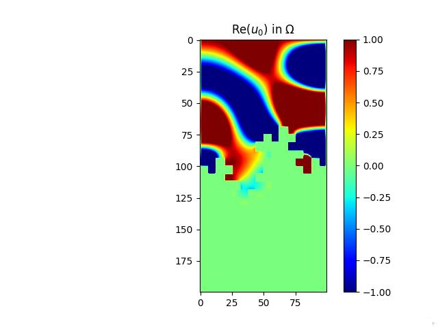
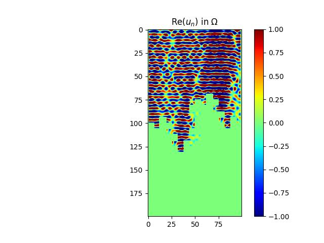
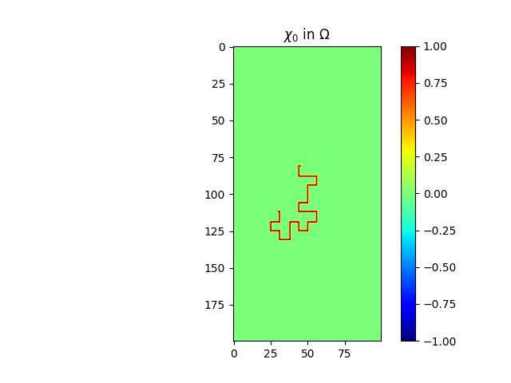
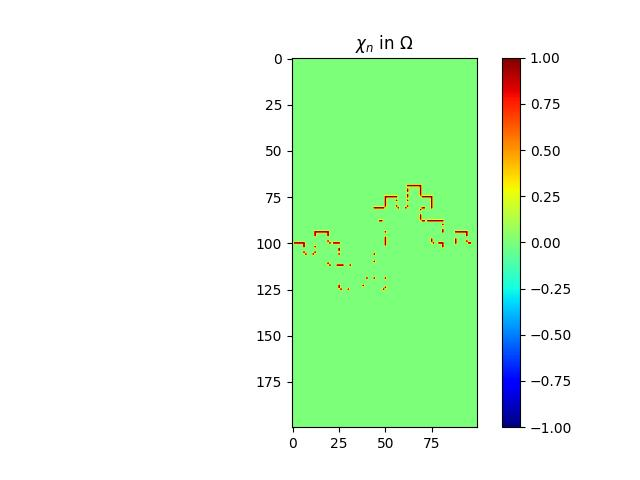

# Acoustical Pollution Control Optimization Project

  
  
  
  

## Introduction

This project, carried out as part of the **Acoustic Pollution Control** course at CentraleSupélec in Fall 2023, aimed to minimize the acoustic energy within various environments, such as concert halls, offices, or aircraft reactors. The main objective was to find the optimal distribution of a porous material within a wall, minimizing noise or maximizing sound absorption. 

The project was developed using Python to solve the **Helmholtz equation** for a domain with specific boundary conditions. The core of the project involved using a **gradient descent optimization algorithm** to minimize the energy by distributing absorbing materials in the most efficient way across various frequency ranges.

## Authors

- Moghit Yebari
- Yi Zhong
- Farouk Yartaoui
- Nabil Alami
- Raphaël Pain Dit Hermier
- Edward Lucyszyn

## Problem Description

We addressed the challenge of minimizing noise in environments like aircraft reactors by optimizing the placement of sound-absorbing materials (liners). The study was divided into **two main components**: a **numerical approach** and a **theoretical analysis**.

### Numerical Study

The numerical study involved solving the **Helmholtz equation** for different configurations of absorbing materials. Key elements of the approach included:

- **Energy Calculation**: The total energy in the domain was calculated using a discretized form of the Helmholtz equation, which accounts for the propagation of sound waves in the reactor. Python was used to implement the **finite difference method** to compute energy across a grid.
  
- **Gradient Descent Optimization**: We used a gradient descent algorithm to iteratively adjust the distribution of the sound-absorbing material. The goal was to minimize the energy in the domain by optimizing the placement of materials while adhering to constraints on the total material quantity.

- **Multi-Frequency Optimization**: Noise sources operate across a range of frequencies, so the optimization process was extended to address multiple frequencies simultaneously. We tested different fractal geometries and material quantities to achieve the best sound attenuation.

### Theoretical Study

The theoretical study focused on the **well-posedness** of the convected Helmholtz equation, which governs sound propagation in the reactor. Our main goals were:

- **Existence and Uniqueness**: We investigated the existence of solutions to the variational form of the Helmholtz equation, proving that the system of equations is well-posed for the configurations we considered.
  
- **Energy Continuity**: We derived the derivative of the energy functional with respect to the distribution of absorbing materials. This analysis provided insights into how changes in material distribution impact the overall energy in the system.

- **Optimization Constraints**: Using functional analysis, we demonstrated the existence of an optimal distribution of materials that minimizes energy within a fixed quantity of material. This theoretical groundwork supported our numerical optimization.

## Results

Our numerical and theoretical analyses showed significant noise reduction in the optimized reactor configurations. Key results included:

- **Fractal Geometry**: Fractal shapes for the absorbing surfaces provided better sound attenuation than flat surfaces.
- **Multi-frequency Optimization**: Our algorithm reduced noise effectively across multiple frequencies, a critical requirement in real-world applications like aircraft reactors.
- **Material Efficiency**: We identified the most effective materials and quantities for sound absorption, optimizing for both performance and cost.

## Documentation

Instructions for the project can be found in instructions.pdf.
The detailed report of the project is available in report.pdf.
The presentation slides are included in slides.pdf.

## Conclusion

This project allowed us to thoroughly explore the finite difference method applied to an aircraft reactor with a fractal geometry. Additionally, it provided us with hands-on experience in implementing an optimization algorithm to reduce noise efficiently. We are satisfied with the outcomes, as our solution successfully minimized energy across different frequencies using minimal material.
